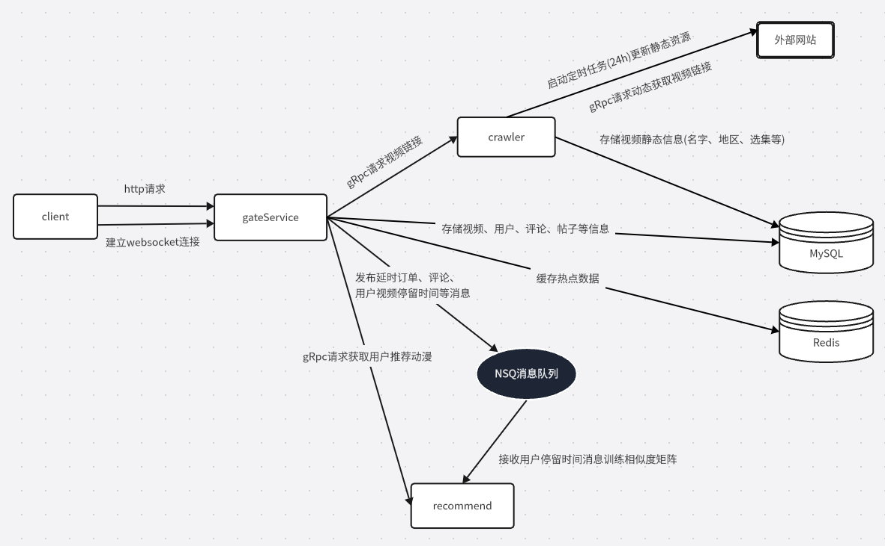

# 🎬 Zanime 动漫资源聚合平台

[](https://golang.org/)
[](https://vuejs.org/)
[](./LICENSE)
[](http://47.98.116.106:8888/)

> 基于分布式架构的动漫资源聚合平台，实现从数据采集到用户交互的完整技术闭环

## ✨ 特性

- 🚪 智能网关架构 - Gin框架实现RESTful API，集成JWT鉴权与API限流中间件
- 💬 高并发评论系统 - Redis缓存+消息队列实现即时展示与异步持久化
- 🕷️ 分布式爬虫引擎 - Colly框架支持80%动漫资源覆盖，双重校验防重复采集
- 🧮 智能推荐系统 - 协同过滤+TF-IDF算法，NSQ实时处理用户行为数据
- 🛒 可靠交易体系 - NSQ延迟队列订单管理+Redis分布式锁库存控制
- 📡 稳定推送服务 - WebSocket长连接+Vue单页复用机制
- 👁️ 实时监控系统 - 分级日志管理+WebSocket实时推送至管理后台
- 🔧 领域驱动设计 - 基于DDD思想的微服务解耦与标准化领域模型

## 🛠️ 技术栈

### 后端


### 前端


### 基础设施


## 🏗️ 架构图



## 🌐 在线体验
**立即访问：** [http://47.98.116.106:8888/](http://47.98.116.106:8888/)

## 🚀 快速开始

### 安装部署
详细部署步骤请参考[部署步骤.md](./部署步骤.md)文档，包含以下核心流程：

```bash
# 克隆仓库
git clone https://github.com/ZongHH/Zanime.git
```

## 📂 关键服务结构
```
zanime/
├── gateService/                   # 网关服务主目录
│   ├── cmd/                       # 程序入口
│   ├── configs/                   # 本地配置文件
│   ├── internal/                  # 内部实现模块
│   │   ├── application/           # 应用层逻辑
│   │   │   ├── connection/        # websocket连接实现
│   │   │   ├── service/           # API服务实现
│   │   │   └── consumer/          # 消费者服务实现
│   │   ├── bootstrap/             # 服务启动初始化
│   │   ├── domain/                # 领域模型层
│   │   │   ├── entity/            # 领域实体定义
│   │   │   ├── repository/        # 存储库接口
│   │   │   └── service/           # 领域服务接口
│   │   ├── infrastructure/        # 基础设施层
│   │   │   ├── config/            # 配置加载器
│   │   │   ├── database/          # 数据库连接池
│   │   │   ├── middleware/        # 中间件组件
│   │   │   │   ├── auth/          # JWT认证中间件
│   │   │   │   ├── lock           # 分布式锁
│   │   │   │   └── websocket/     # WebSocket管理
│   │   │   ├── grpc/              # gRPC通信模块
│   │   │   │   ├── client/        # gRPC客户端
│   │   │   │   │   ├── recommend/ # 推荐服务客户端
│   │   │   │   │   └── scrapeClient/ # 爬虫服务客户端
│   │   │   │   ├── server/        # gRPC服务端
│   │   │   │   │   └── tokenService/ # 令牌服务实现
│   │   │   │   └── proto          # proto文件目录
│   │   └── interfaces/            # 对外接口层
│   │       ├── dto                # 数据传输对象
│   │       ├── http/              # HTTP接口
│   │       │   ├── handler/       # 请求处理器
│   │       │   ├── middleware     # HTTP中间件
│   │       │   └── router/        # 路由配置
│   ├── tests/                     # 测试模块
│   └── pkg/                       # 公共工具包
│       ├── logger/                # 日志组件
│       ├── monitor/               # 监控模块
│       ├── errors/                # 错误处理封装
│       ├── mq/                    # 消息队列封装
│       │   └── nsqpool/           # NSQ连接池
│       └── password/              # 密码安全模块
└── crawler/               # 爬虫服务主模块
    ├── cmd/               # 程序入口
    ├── configs/           # 配置文件
    ├── internal/          # 核心实现
    │   ├── application/   # 应用层
    │   │   ├── crawler/   # 爬虫核心逻辑
    │   │   └── search/    # 搜索模块
    │   ├── bootstrap/     # 启动初始化
    │   ├── domain/        # 领域模型
    │   │   ├── entity/    # 领域实体
    │   │   ├── repository/ # 存储接口
    │   │   └── service/   # 领域服务
    │   ├── grpc/          # gRPC模块
    │   │   └── scrapeService/ # 爬虫gRPC服务
    │   └── infrastructure/ # 基础设施
    │       ├── collector/  # 数据收集
    │       ├── config/     # 配置加载
    │       └── database/   # 数据库管理
    ├── pkg/               # 工具库
    │   ├── monitor/       # 性能监控
    │   ├── mq/            # 消息队列
    │   │   └── nsqpool/   # NSQ连接池
    │   └── random/        # 随机工具
    └── tests/             # 测试套件
```
